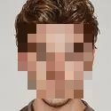

# Face Mosaic Detection with OpenCV

## 프로젝트 소개

이 프로젝트는 OpenCV의 Haar Cascade 분류기를 사용하여 이미지에서 얼굴을 자동으로 감지하고, 감지된 얼굴 영역에 모자이크 효과를 적용하여 개인정보를 보호하는 컴퓨터 비전 기반 얼굴 블러 처리 시스템입니다.

- **기술**: OpenCV, Haar Cascade 분류기, 이미지 처리
- **언어**: Python 3.10.9
- **환경**: Jupyter Notebook

---

## 프로젝트 구조

```
Mosaic/
├── mosaic.ipynb          # 메인 Jupyter 노트북 파일
├── face.jpg             # 입력 이미지 (원본)
├── face_mosaic.jpg      # 출력 이미지 (모자이크 처리됨)
└── README.md           # 프로젝트 설명서
```

- `mosaic.ipynb`: 얼굴 감지 및 모자이크 처리 코드가 포함된 메인 노트북
- `face.jpg`: 테스트용 원본 이미지
- `face_mosaic.jpg`: 얼굴이 모자이크 처리된 결과 이미지

---

## 실행 방법

1. **필수 라이브러리 설치**
   ```bash
   pip install opencv-python numpy jupyter
   ```

2. **노트북 실행**
   - `mosaic.ipynb` 파일을 Jupyter Notebook에서 실행하세요.
   - 각 셀을 순서대로 실행하면 얼굴 감지, 모자이크 처리, 결과 저장이 진행됩니다.

3. **코드 실행 순서**
   - 얼굴 감지 모델(Haar Cascade) 로드
   - 입력 이미지 읽기 및 색상 공간 변환
   - 얼굴 영역 감지
   - 감지된 얼굴에 모자이크 효과 적용
   - 결과 이미지 저장

---

## 주요 기능

### 얼굴 감지 (Face Detection)
- Haar Cascade 분류기를 사용한 정확한 얼굴 감지
- 다양한 각도와 크기의 얼굴 인식 가능
- 실시간 처리 지원

### 모자이크 처리 (Mosaic Effect)
- 감지된 얼굴 영역에 픽셀화된 모자이크 효과 적용
- 조정 가능한 모자이크 강도 (factor 파라미터)
- 개인정보 보호를 위한 자동화된 블러 처리

---

## 주요 코드/구조

- **얼굴 감지**: `cv2.CascadeClassifier`를 활용한 Haar Cascade 분류기
- **모자이크 함수**: 이미지 축소 후 확대를 통한 픽셀화 효과
- **이미지 처리**: BGR/RGB 색상 공간 변환 및 고품질 출력
- **비디오 처리**: 실시간 비디오 스트림에서 얼굴 감지 및 모자이크 적용

### 핵심 코드 예시

```python
# 얼굴 감지 모델 로드
face_cascade = cv2.CascadeClassifier(cv2.data.haarcascades + 'haarcascade_frontalface_default.xml')

# 모자이크 함수 정의
def apply_mosaic(image, factor=0.1):
    small = cv2.resize(image, None, fx=factor, fy=factor, interpolation=cv2.INTER_LINEAR)
    return cv2.resize(small, image.shape[:2][::-1], interpolation=cv2.INTER_NEAREST)

# 얼굴 감지 및 모자이크 적용
faces = face_cascade.detectMultiScale(img, 1.1, 4)
for (x, y, w, h) in faces:
    img[y:y+h, x:x+w] = apply_mosaic(img[y:y+h, x:x+w])
```

---

## 결과 예시

### 입력 이미지 (원본)


### 출력 이미지 (모자이크 처리됨)


**모자이크 강도 조정**
- `factor=0.1`: 강한 모자이크 (기본값)
- `factor=0.2`: 중간 모자이크
- `factor=0.05`: 매우 강한 모자이크

---

## 참고/응용

- 개인정보 보호가 필요한 이미지/비디오 처리
- 얼굴 인식 및 컴퓨터 비전 학습
- OpenCV 기반 이미지 처리 실습
- 실시간 얼굴 블러 처리 시스템 구축 