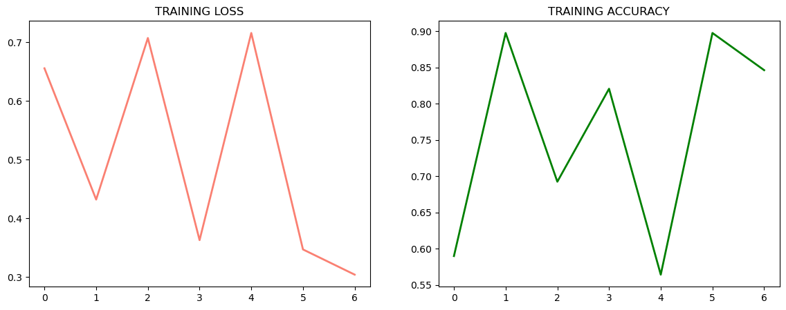

# 화재/연기 이미지 분류 딥러닝 프로젝트

이 프로젝트는 딥러닝(CNN)을 활용하여 이미지에서 화재와 연기를 분류하는 모델입니다.
TensorFlow와 Keras를 사용하며, 데이터 전처리부터 모델 학습, 평가, 시각화까지의 전 과정을 Jupyter Notebook으로 구현했습니다.

---

## 프로젝트 구조

```
.
├── fire_detection.ipynb   # 전체 코드가 담긴 주피터 노트북
├── data/                 # 학습용 데이터 (train-smoke, train_fire)
├── input/                # 원본 데이터 (test_big, test_small, train-smoke, train_fire)
├── splitted_data/        # 학습/검증 데이터 분할 (train, val)
└── .ipynb_checkpoints/   # 주피터 자동 저장 파일
```

---

## 데이터 구성

- **input/**: 원본 이미지 데이터
  - `train_fire/`: 화재 이미지
  - `train-smoke/`: 연기 이미지
  - `test_big/`, `test_small/`: 테스트용 이미지
- **data/**: 학습용 데이터 복사본
- **splitted_data/**: 학습/검증 데이터셋
  - `train/`, `val/`: 학습/검증용 이미지

---

## 주요 내용 및 실행 흐름

1. **모듈 및 라이브러리 import**
   - TensorFlow 2.9.3, Keras, matplotlib

2. **데이터 준비 및 분할**
   - `input/` 폴더의 이미지를 `data/`로 복사
   - `ImageDataGenerator`로 증강 및 전처리
   - `splitted_data/`에 train/val 데이터 분할

3. **모델 구조**
   - 간단한 CNN(합성곱 신경망) 사용
   - 구조: Conv2D(7x7) → MaxPool → Conv2D(3x3) → MaxPool → Flatten → Dense(256) → Dense(1, sigmoid)
   - Optimizer: Adam, Loss: binary_crossentropy, Metric: accuracy

4. **학습 및 평가**
   - 7 epoch 동안 학습
   - 검증 데이터로 성능 평가

5. **결과 시각화**
   - 학습 과정의 loss/accuracy 그래프 출력



---

## 실행 방법

1. 필요한 패키지 설치
   ```bash
   pip install tensorflow matplotlib
   ```
2. Jupyter Notebook에서 `fire_detection.ipynb` 실행
3. 데이터 폴더(`input/`, `data/`, `splitted_data/`)가 프로젝트 내에 있어야 함

---

## 참고/특이사항

- 데이터 폴더 구조가 맞지 않으면 코드 실행 시 오류가 발생할 수 있습니다.
- 이미지 크기는 64x64로 리사이즈하여 학습합니다.
- 클래스는 `train_fire`(화재), `train-smoke`(연기) 두 가지입니다.