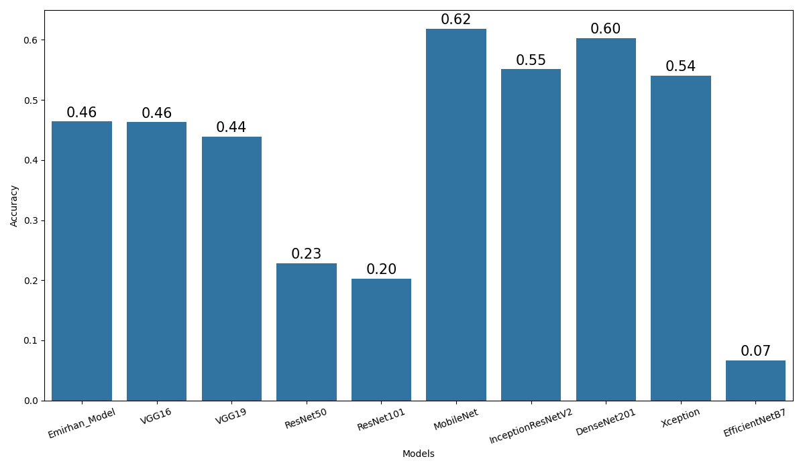
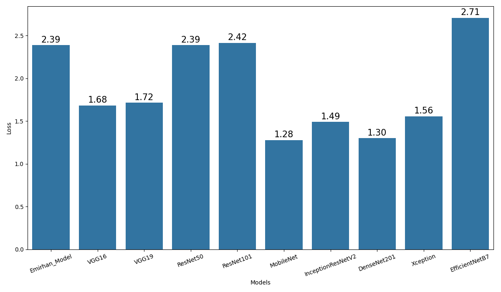

# Human Action Detection with Artificial Intelligence

## 프로젝트 소개

이 프로젝트는 다양한 인간 행동(예: 달리기, 앉기, 자전거 타기 등)을 이미지로부터 분류하는 딥러닝 기반의 행동 인식 모델을 구현하고, 여러 유명 CNN 아키텍처(VGG, ResNet, MobileNet 등)와 커스텀 모델의 성능을 비교하는 데 목적이 있습니다.

- **데이터셋**: 15가지 인간 행동 클래스, 총 18,000장(학습 15,000장, 테스트 3,000장)
- **모델**: VGG16/19, ResNet50/101, MobileNet, DenseNet201, EfficientNetB7, Xception, InceptionResNetV2, 커스텀 CNN(Emirhan)
- **프레임워크**: TensorFlow, Keras

---

## 데이터셋 구조

```
datasets/
└── human_data/
    ├── train_data/
    │   ├── calling/
    │   ├── clapping/
    │   ├── cycling/
    │   ├── dancing/
    │   ├── drinking/
    │   ├── eating/
    │   ├── fighting/
    │   ├── hugging/
    │   ├── laughing/
    │   ├── listening_to_music/
    │   ├── running/
    │   ├── sitting/
    │   ├── sleeping/
    │   ├── texting/
    │   └── using_laptop/
    └── test_data/
        └── (동일 구조)
```

- 각 폴더명은 행동 클래스(총 15개)를 의미합니다.
- 각 폴더에는 해당 행동의 이미지가 다수 포함되어 있습니다.

---

## 실행 방법

1. **필수 라이브러리 설치**
   ```bash
   pip install tensorflow keras opencv-python pillow numpy pandas seaborn matplotlib scikit-learn
   ```

2. **데이터 준비**
   - 위의 폴더 구조에 맞게 `datasets/human_data/` 하위에 데이터를 배치하세요.

3. **노트북 실행**
   - `human_detection.ipynb` 파일을 Jupyter Notebook 또는 Colab에서 실행하세요.
   - 각 셀을 순서대로 실행하면 데이터 준비, 모델 학습, 성능 비교, 결과 시각화가 진행됩니다.

---

## 지원하는 행동 클래스

- calling, clapping, cycling, dancing, drinking, eating, fighting, hugging, laughing, listening_to_music, running, sitting, sleeping, texting, using_laptop

---

## 주요 코드/구조

- **데이터 로딩 및 전처리**: `ImageDataGenerator`를 활용한 이미지 증강 및 정규화
- **모델 구조**: 사전학습(pretrained) 모델과 커스텀 CNN 모델(Emirhan) 비교
- **학습 및 평가**: 각 모델별로 학습 후, 정확도/손실/분류 리포트 출력 및 시각화
- **결과 비교**: 모델별 성능을 표와 그래프로 한눈에 비교

---

## 결과 예시

- 모델별 정확도/손실을 DataFrame 및 barplot으로 시각화

**정확도 비교**


**손실 비교**


---

## 참고/응용

- 다양한 CNN 구조의 전이학습 및 커스텀 모델 설계 실습에 적합
- 행동 인식, 이미지 분류, 딥러닝 벤치마킹 등 연구/실습에 활용 가능
